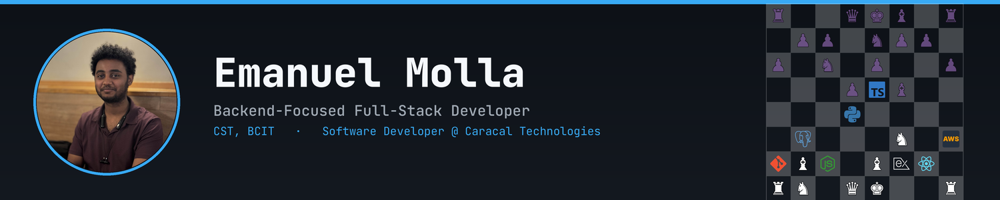

  

[**emanuelmolla.dev**](https://emanuelmolla.dev) &nbsp;·&nbsp; [**emanuelmolla@outlook.com**](mailto:emanuelmolla@outlook.com)

## About

Backend-focused full-stack developer studying Computer Systems Technology at BCIT. I build scalable web applications with clean, efficient code and love solving complex problems.

When I'm not coding, you'll find me playing chess - always up for a game!

## Recent Projects

**DevNest** - Full-stack project management app for developers  
*React • Node.js • Express • MongoDB*

**Vivid Africa** - Booking platform for a real client (a tour company) with tour booking, email notifications, and an admin panel for content customization  
*Next.js • Express • PostgreSQL • Cloudflare R2*

## Tech Stack

